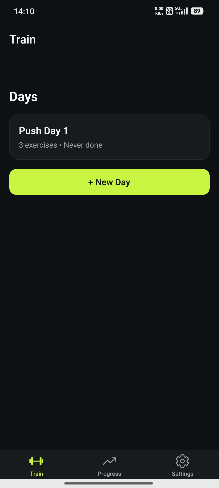
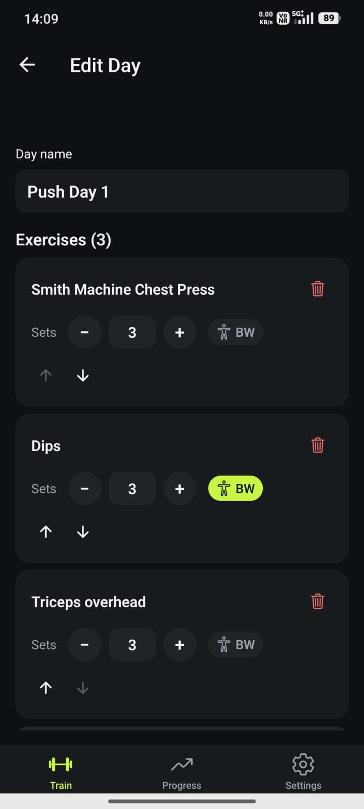
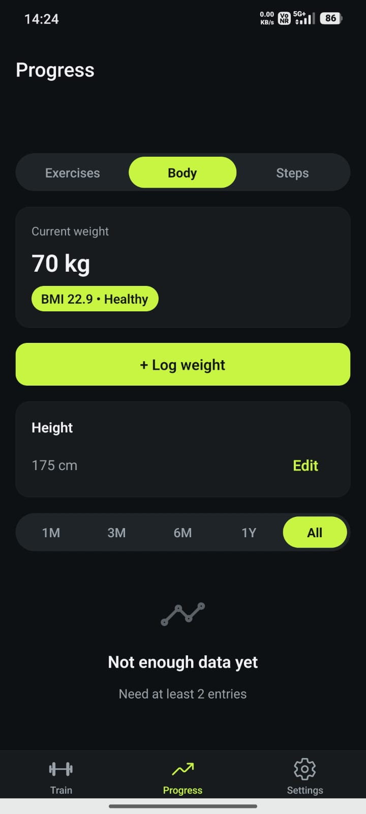
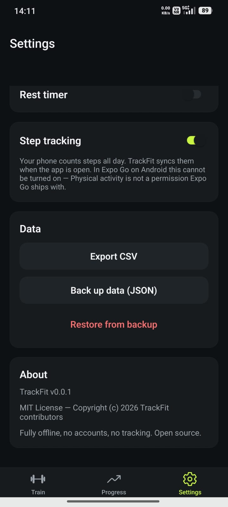

# TrackFit

A gym log that stays on your phone.

**[Download the Android APK](https://github.com/kruxarth/TrackFit/releases/tag/v.0.0.2)** from the v0.0.2 release. Sideload the `.apk` — it is not on the Play Store.

Most workout apps want an account, a feed, an AI coach, and a reason to open the store. TrackFit is the opposite: you create days (Pull, Push, whatever you actually train), log weight and reps, rest between sets, and look back at what you lifted.

**No account. No cloud. No ads. No AI telling you what to do.** Your workouts never leave the device unless you export them.

  
  
  
  

## Features

### Train

- **Day templates.** Build splits as named days (Push Day 1, Pull, whatever you actually run). Add exercises as free text — no canned catalog.
- **Sets and bodyweight.** Pick how many sets each movement should have. Mark an exercise as bodyweight and add extra kg when you need it (weighted dips, etc.).
- **Start a workout.** Opening a day clones it into today’s log. Changing the template later does not rewrite past sessions.
- **Carry-forward.** Weight and reps come in from the last time you logged that exercise, so you are not typing 80 × 5 from scratch. Confirm each set when you actually do it.
- **Per-exercise units.** Tap the lbs/kg label next to a weight to switch that exercise only. Other movements in the same workout keep their units.
- **Rest between sets.** After you mark a set done, a countdown runs. On by default; turn it off or change the length in Settings.
- **History.** Past workouts stay in a log you can open again.

### Progress

- **Exercise charts.** Search an exercise you have logged. See max weight over 1 month, 3 months, 6 months, 1 year, or all time.
- **Body.** Log body weight, store height, and get BMI plus a weight trend.

### Settings and data

- **kg or lbs.** Stored as kg under the hood. Settings sets the default; each logged exercise can use its own unit.
- **Appearance.** System, light, or dark.
- **CSV export.** Workouts, body metrics, and any previously recorded steps, shared through the system share sheet.
- **JSON backup and restore.** Full dump of local data so you can move phones. Restore replaces everything currently on the device.

## Why this instead of Strong / Hevy / the rest

- **You are not the product.** Nothing is uploaded. There is no feed, no streak guilt, no “upgrade for charts.”
- **No coach in the loop.** Your splits, your names, your numbers.
- **Quiet on the gym floor.** Confirm a set, rest, lift. Not a social app wearing a barbell icon.
- **Yours to keep.** Export or back up whenever you want. Uninstalling the app deletes local data — there is no cloud copy.
- **Open source (MIT).** You can read what it does. v0.0.2 — early, on purpose.

## Install

Android: the `.apk` on **[v0.0.2](https://github.com/kruxarth/TrackFit/releases/tag/v.0.0.2)**. That is a sideload, not the Play Store.

iPhone cannot install an APK. An App Store / TestFlight build is a separate release.

## License

MIT — Copyright (c) 2026 TrackFit contributors
